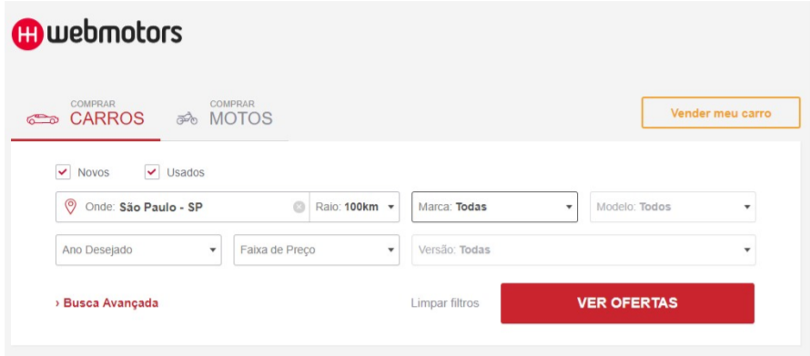
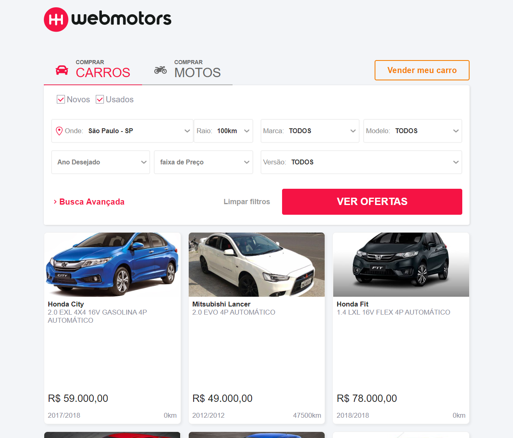
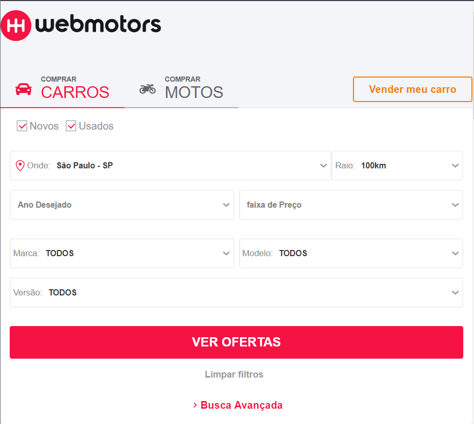
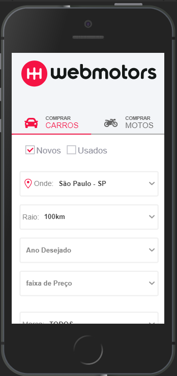

<h1 align="center">
    
</h1>

<h3 align="center">
  🔎 Webmotors Challenge 🚗
</h3>

  <a href="#rocket-sobre-o-desafio">Sobre</a>&nbsp;&nbsp;&nbsp;|&nbsp;&nbsp;&nbsp;
  <a href='#gear-oque-foi-utilizado'>Oque foi utilizado</a>&nbsp;&nbsp;&nbsp;|&nbsp;&nbsp;&nbsp;
  <a href="#camera-imagens">Imagens</a>&nbsp;&nbsp;&nbsp;|&nbsp;&nbsp;&nbsp;
  <a href="#Instalar e usar">Instalar e usar</a>

## 🚚 Sobre

 Desafio de recriar a tela de busca da web motors utiliazndo reactJS e responsivo.

 

## ⚙️ Oque foi utilizado

  - React
  - React hooks
  - Select
  - Axios
  - polished
  - eslint
  - prettier
  - styled-components
  - history
  - prop-types
  - react-icons
  - react-router-dom
  - Api do desafio da webmotors

## 📷 Imagens

<strong>Layout proposto</strong>

 
<strong>Layout desenvolvido</strong>

 

 

## 🚀 Instalar e usar

###### Clone o respostiorio. 
``git clone git@github.com:nelsonplinio/web-motors-challenge.git``

###### Instalar as dependencias. 
``cd web-motors-challenge ``
`` yarn ou npm install``

###### Instalar as dependencias. 
``yarn start ou npm run start ``
